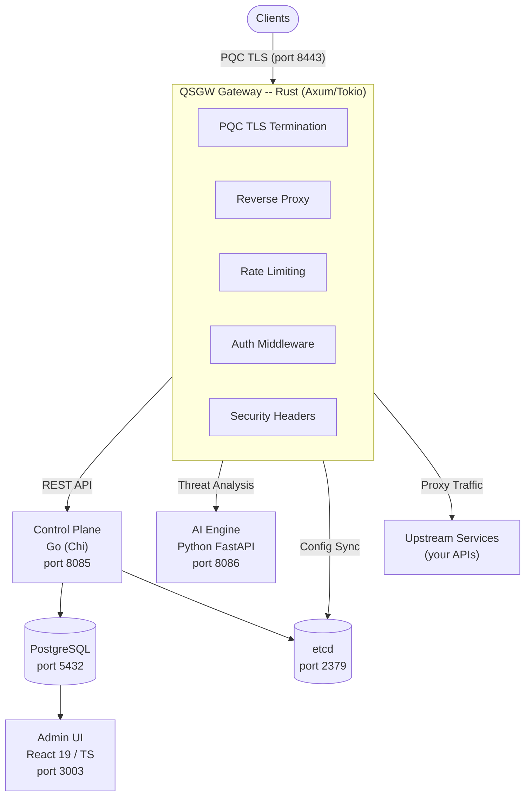

<div align="center">

<!-- HERO SECTION -->

<br>


<br><br>

# Quantum-Safe API Gateway

### The world's first open-source API gateway with native post-quantum TLS

<br>

**Drop-in quantum-safe replacement for Kong & Apigee**

<br>

[](https://github.com/yazhsab/qbitel-qsgw/actions)
[](LICENSE)
[](https://www.rust-lang.org)
[](https://go.dev)
[](https://python.org)
[](https://react.dev)
[](https://csrc.nist.gov/projects/post-quantum-cryptography)
[](CONTRIBUTING.md)

<br>

[](https://github.com/yazhsab)

<br>

[Quick Start](#-quick-start) &bull; [Features](#-key-features) &bull; [Architecture](#-architecture) &bull; [Docs](#-documentation) &bull; [Contributing](#-community--contributing)

<br>

---

</div>

<br>

## The Problem: Your API Gateway Is Already Compromised

<br>

<div align="center">

> **"Nation-state actors are recording encrypted traffic TODAY, waiting for quantum computers to decrypt it TOMORROW. Your API gateway is the #1 target."**

</div>

<br>

The cybersecurity landscape has fundamentally shifted. **Harvest Now, Decrypt Later (HNDL)** is not a theoretical risk -- it is an active, documented strategy used by sophisticated adversaries worldwide. Encrypted data captured today -- financial transactions, healthcare records, government communications, API payloads -- will be trivially decryptable once cryptographically relevant quantum computers arrive.

Your API gateway sits at the most critical junction in your infrastructure. **Every request, every response, every authentication token, every piece of sensitive data flows through it.** If your gateway uses classical TLS, every byte of that traffic is being archived by adversaries who are simply... waiting.

The NIST post-quantum cryptography standards (FIPS 203, 204, 205) were finalized for a reason. The clock is ticking.

**QSGW is the answer.**

<br>

---

<br>

## Why QSGW?

<br>

<table>
<tr>
<td width="50%">

### Quantum-Safe by Default

The **first** open-source API gateway with native post-quantum TLS. Not a plugin. Not an extension. Built into the core from day one with FIPS 203/204/205 compliant algorithms.

</td>
<td width="50%">

### Blazing Fast, Memory Safe

Built in **Rust** with Tokio and Axum. Zero-copy request forwarding, async I/O, and sub-millisecond per-request overhead. **10,000+ concurrent connections** out of the box.

</td>
</tr>
<tr>
<td width="50%">

### AI-Powered Threat Detection

Intelligent threat analysis catches what rules miss. Quantum downgrade attacks, bot traffic, anomalous patterns, and replay attacks -- detected and flagged in real time.

</td>
<td width="50%">

### 4 TLS Migration Policies

Go quantum-safe at your own pace. From `CLASSICAL_ALLOWED` for legacy support to `PQC_ONLY` for maximum security. **No big-bang migration required.**

</td>
</tr>
<tr>
<td width="50%">

### Drop-in Replacement

Replace Kong, Apigee, or Nginx without rewriting your stack. Same reverse-proxy patterns, same routing model, same operational workflows -- with quantum-safe security added.

</td>
<td width="50%">

### Zero-Trust Architecture

JWT and API key authentication, per-IP rate limiting, security headers (HSTS, CSP, X-Frame-Options), and role-based access control. Defense in depth, every layer.

</td>
</tr>
</table>

<br>

---

<br>

## Key Features

<br>

### :lock: Post-Quantum TLS Termination

Full NIST compliance: FIPS 203 (ML-KEM), FIPS 204 (ML-DSA), FIPS 205 (SLH-DSA). Hybrid X25519 + ML-KEM-768 key exchange for transitional deployments. Four configurable TLS policies to match your migration timeline.

### :rocket: High-Performance Reverse Proxy

Rust-native data plane powered by **Tokio** and **Axum**. Async I/O, zero-copy forwarding, configurable upstream timeouts, hop-by-hop header stripping, and intelligent load balancing. Handles **10,000+ concurrent connections** with sub-millisecond overhead.

### :robot: AI-Powered Threat Detection

Python FastAPI engine with real-time anomaly detection. Identifies quantum downgrade attempts, weak cipher negotiation, bot activity (user-agent fingerprinting, rate analysis, path diversity scoring), traffic anomalies, certificate issues, and replay attacks.

### :control_knobs: Control Plane API

Go-powered REST API (Chi router) for managing gateways, routes, upstreams, and threat events. JWT + API key authentication with constant-time comparison. Full CRUD operations with PostgreSQL persistence and etcd coordination.

### :bar_chart: Real-Time Admin Dashboard

React 19 + TypeScript SPA for monitoring your entire gateway fleet. Visualize gateways, upstreams, routes, and threat events. Real-time status, health checks, and alerting -- all in a modern, responsive UI.

### :shield: Zero-Trust Security

Defense in depth: JWT (HS256) and API key authentication, per-IP sliding window rate limiting, HSTS, CSP, X-Frame-Options, configurable CORS, request body limits, and role-based access control with bypass path configuration.

<br>

---

<br>

## TLS Migration Policies

Choose the policy that matches your security requirements and client ecosystem.

<br>

| Policy | Cipher Suites | Fallback | Best For | Recommendation |
|:------:|:-------------:|:--------:|:---------|:--------------:|
| **`PQC_ONLY`** | Post-quantum only | None -- classical rejected | Maximum quantum safety. Requires PQC-capable clients. | :red_circle: Highest Security |
| **`PQC_PREFERRED`** | PQC preferred | Hybrid fallback | **Recommended default.** Best balance of security and compatibility. | :green_circle: Recommended |
| **`HYBRID`** | X25519 + ML-KEM-768 | Classical + PQC combined | Transitional deployments with mixed client environments. | :yellow_circle: Transitional |
| **`CLASSICAL_ALLOWED`** | PQC available | Classical permitted | Legacy compatibility during phased migration. | :orange_circle: Migration |

<br>

---

<br>

## Threat Detection

QSGW identifies and classifies six categories of threats in real time.

<br>

| Severity | Threat Type | Description |
|:--------:|:------------|:------------|
| :red_circle: **CRITICAL** | `QUANTUM_DOWNGRADE` | Attempts to force classical cipher suites, exposing traffic to future quantum decryption |
| :orange_circle: **HIGH** | `WEAK_CIPHER` | Use of deprecated or weak cipher suites (RC4, DES, 3DES, MD5, SHA1) |
| :orange_circle: **HIGH** | `BOT_ATTACK` | Automated traffic attempting data harvesting or endpoint probing |
| :orange_circle: **HIGH** | `REPLAY_ATTACK` | Detected replay of previously captured TLS sessions |
| :yellow_circle: **MEDIUM** | `ANOMALOUS_TRAFFIC` | Unusual traffic patterns, rate spikes, or abnormal handshake durations |
| :yellow_circle: **MEDIUM** | `CERTIFICATE_ISSUE` | Invalid, expired, or misconfigured TLS certificates |

See [docs/THREAT_DETECTION.md](docs/THREAT_DETECTION.md) for detection methodologies and response actions.

<br>

---

<br>

## Architecture



**Traffic flow:** Clients connect to the Gateway over PQC TLS (port 8443). The Gateway terminates TLS, enforces cipher suite policy, applies rate limiting and authentication, then reverse-proxies requests to upstream services. The Control Plane manages configuration via REST API. The AI Engine analyzes traffic patterns for threats in real time. The Admin Dashboard provides operational visibility.

<br>

---

<br>

## Performance Benchmarks

<br>

| Metric | Value | Notes |
|:-------|:-----:|:------|
| **Concurrent Connections** | 10,000+ | Configurable via Tokio runtime, async I/O |
| **Per-Request Overhead** | < 1ms | Sub-millisecond proxy overhead |
| **PQC TLS Handshake** | 1-3ms | vs classical ECDHE; hybrid X25519 + ML-KEM-768 |
| **Request Forwarding** | Zero-copy | Minimal allocation, hop-by-hop header stripping |
| **Rate Limiter** | O(1) | In-memory sliding window, capped at 100K tracked keys |
| **AI Threat Evaluation** | < 1ms | Rule-based anomaly + bot detection per request |
| **Upstream Timeout** | 30s default | Configurable per-route |

<br>

---

<br>

## Quick Start

Get QSGW running in under 60 seconds.

```bash
# Clone the repository
git clone https://github.com/yazhsab/qbitel-qsgw.git && cd qbitel-qsgw

# Copy the example environment configuration
cp .env.example .env

# Start everything (Gateway, Control Plane, AI Engine, Admin UI, PostgreSQL, etcd)
make docker-all
```

**Verify services are running:**

```bash
curl http://localhost:8085/health    # Control Plane
curl http://localhost:8086/health    # AI Engine
```

| Service | URL | Description |
|:--------|:----|:------------|
| **Gateway** | `https://localhost:8443` | PQC TLS reverse proxy |
| **Control Plane** | `http://localhost:8085` | REST API for gateway management |
| **AI Engine** | `http://localhost:8086` | Real-time threat analysis |
| **Admin UI** | `http://localhost:3003` | Monitoring dashboard |

<br>

---

<br>

## Tech Stack

<br>

<div align="center">

[](https://www.rust-lang.org)
[](https://go.dev)
[](https://python.org)
[](https://react.dev)
[](https://www.typescriptlang.org)
[](https://www.postgresql.org)
[](https://etcd.io)
[](https://www.docker.com)
[](https://tokio.rs)
[](https://fastapi.tiangolo.com)

</div>

<br>

| Component | Technology | Role |
|:----------|:-----------|:-----|
| **Gateway (Data Plane)** | Rust, Axum, Tokio | PQC TLS termination, reverse proxy, rate limiting, auth |
| **Crypto Library** | Rust | ML-KEM, ML-DSA, SLH-DSA, hybrid schemes, secure RNG |
| **Control Plane** | Go, Chi | REST API, gateway/route/upstream management, JWT auth |
| **AI Engine** | Python, FastAPI | Anomaly detection, bot detection, threat classification |
| **Admin Dashboard** | React 19, TypeScript | Real-time monitoring, gateway fleet management |
| **Database** | PostgreSQL | Persistent storage for gateways, routes, threats |
| **Configuration** | etcd | Distributed configuration coordination |
| **Infrastructure** | Docker, Docker Compose | Containerized deployment |

<br>

---

<br>

## QSGW vs Traditional Gateways

<br>

| Feature | QSGW | Kong | Apigee | Envoy | Nginx |
|:--------|:----:|:----:|:------:|:-----:|:-----:|
| Post-Quantum TLS (FIPS 203/204/205) | :white_check_mark: | :x: | :x: | :x: | :x: |
| Hybrid PQC + Classical Key Exchange | :white_check_mark: | :x: | :x: | :x: | :x: |
| Quantum Downgrade Attack Detection | :white_check_mark: | :x: | :x: | :x: | :x: |
| AI-Powered Threat Detection | :white_check_mark: | Plugin | Plugin | :x: | :x: |
| Configurable TLS Migration Policies | :white_check_mark: | :x: | :x: | :x: | :x: |
| Reverse Proxy | :white_check_mark: | :white_check_mark: | :white_check_mark: | :white_check_mark: | :white_check_mark: |
| Rate Limiting | :white_check_mark: | :white_check_mark: | :white_check_mark: | :white_check_mark: | :white_check_mark: |
| JWT Authentication | :white_check_mark: | :white_check_mark: | :white_check_mark: | :white_check_mark: | Plugin |
| Admin Dashboard | :white_check_mark: | :white_check_mark: | :white_check_mark: | :x: | :x: |
| Built in Rust (Memory Safe) | :white_check_mark: | :x: (Lua/Go) | :x: (Java) | :x: (C++) | :x: (C) |
| Open Source | :white_check_mark: | Partial | :x: | :white_check_mark: | :white_check_mark: |
| Zero-Copy Forwarding | :white_check_mark: | :x: | :x: | :white_check_mark: | :white_check_mark: |

<br>

---

<br>

## Supported Cryptographic Algorithms

<br>

| Standard | Algorithm | Variants | Purpose | Status |
|:---------|:----------|:---------|:--------|:------:|
| **FIPS 203** | ML-KEM | ML-KEM-512, ML-KEM-768, ML-KEM-1024 | Key Encapsulation Mechanism | :white_check_mark: Implemented |
| **FIPS 204** | ML-DSA | ML-DSA-44, ML-DSA-65, ML-DSA-87 | Digital Signatures | :white_check_mark: Implemented |
| **FIPS 205** | SLH-DSA | SHA2-128s/f, SHA2-192s/f, SHA2-256s/f | Stateless Hash-Based Signatures | :white_check_mark: Implemented |
| **Hybrid** | X25519 + ML-KEM-768 | -- | Hybrid Key Exchange | :white_check_mark: Implemented |
| **Hybrid** | Ed25519 + ML-DSA-65 | -- | Hybrid Digital Signatures | :white_check_mark: Implemented |

<br>

---

<br>

## Roadmap

<br>

| Quarter | Milestone | Description |
|:-------:|:----------|:------------|
| **Q2 2026** | mTLS & Certificate Management | Mutual TLS with PQC certificates, automated rotation, ACME integration |
| **Q3 2026** | Kubernetes-Native Deployment | Helm charts, CRDs, operator pattern, Istio/Linkerd service mesh integration |
| **Q4 2026** | Plugin Ecosystem & SDK | Extensible plugin framework, Wasm-based middleware, community plugin marketplace |

<br>

---

<br>

## Documentation

<br>

| Document | Description |
|:---------|:------------|
| :building_construction: [Architecture](docs/ARCHITECTURE.md) | System design, data flow, and component interactions |
| :book: [API Reference](docs/API.md) | Complete API documentation with request/response examples |
| :gear: [Gateway Configuration](docs/GATEWAY_CONFIG.md) | TLS policies, routes, upstreams, and middleware pipeline |
| :ship: [Deployment Guide](docs/DEPLOYMENT.md) | Docker, Kubernetes, production setup, and scaling |
| :hammer_and_wrench: [Development Guide](docs/DEVELOPMENT.md) | Local setup, building, testing, and extending |
| :mag: [Threat Detection](docs/THREAT_DETECTION.md) | Anomaly detection, bot detection, and threat classification |
| :handshake: [Contributing](CONTRIBUTING.md) | How to contribute to QSGW |
| :closed_lock_with_key: [Security Policy](SECURITY.md) | Vulnerability reporting and cryptographic standards |
| :scroll: [Changelog](CHANGELOG.md) | Release history |

<br>

---

<br>

## Ecosystem

QSGW is part of the **Qbitel** quantum-safe product family.

<br>

| Product | Description | Status |
|:--------|:------------|:------:|
| **[QSGW](https://github.com/yazhsab/qbitel-qsgw)** | Quantum-Safe API Gateway | :white_check_mark: Available |
| **QRAP** | Quantum-Resistant Application Proxy | Coming Soon |
| **PQC-SDK** | Post-Quantum Cryptography SDK for application developers | Coming Soon |

<br>

---

<br>

## Community & Contributing

We welcome contributions from the community. Whether it is a bug report, feature request, documentation improvement, or code contribution -- every contribution matters.

**Get started:**

1. Read the [Contributing Guide](CONTRIBUTING.md)
2. Check out [open issues](https://github.com/yazhsab/qbitel-qsgw/issues)
3. Fork the repo and submit a PR

**Development commands:**

```bash
make build          # Build all components (Rust + Go + Node)
make test           # Run all tests
make lint           # Run all linters
make docker-all     # Start full stack via Docker
make docker-down    # Tear down all services
```

See [docs/DEVELOPMENT.md](docs/DEVELOPMENT.md) for the full developer guide.

<br>

**Security:** QSGW takes security seriously. If you discover a vulnerability, please report it responsibly via our [Security Policy](SECURITY.md).

<br>

---

<br>

<div align="center">

<br>

**Built with :heart: by [Qbitel](https://github.com/yazhsab)**

<br>

**[QSGW](https://github.com/yazhsab/qbitel-qsgw)** &bull; **QRAP** &bull; **PQC-SDK**

*Securing the post-quantum future, one API at a time.*

<br>

Copyright 2026 Qbitel. Licensed under [Apache License 2.0](LICENSE).

<br>

</div>
