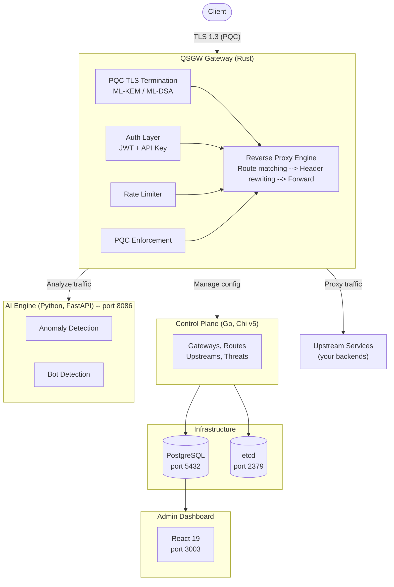
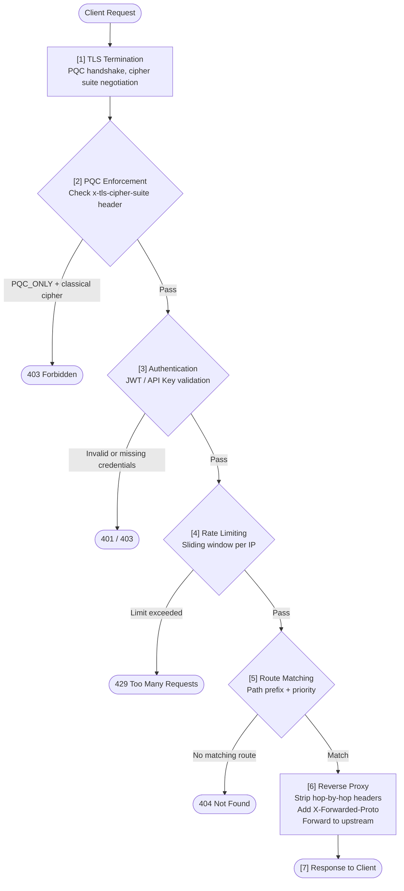
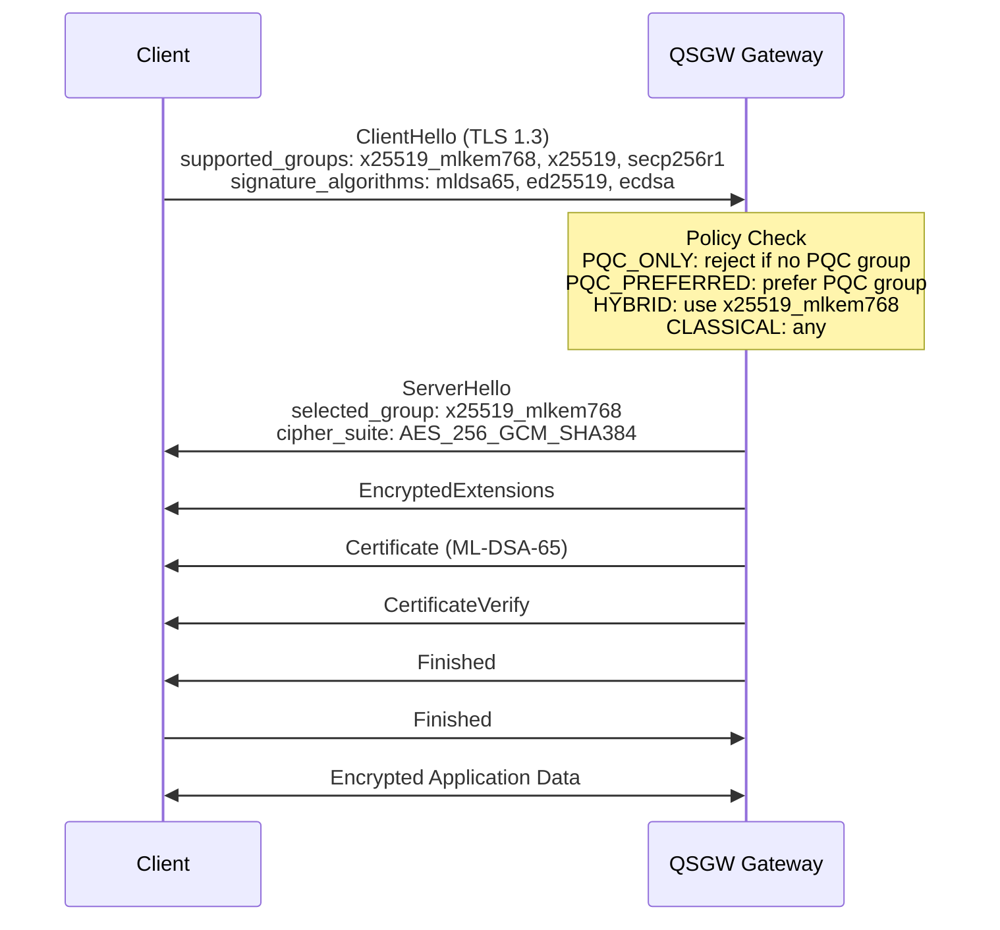
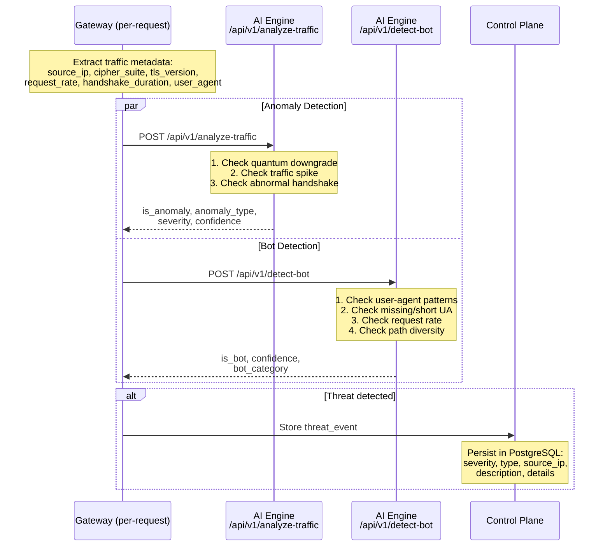
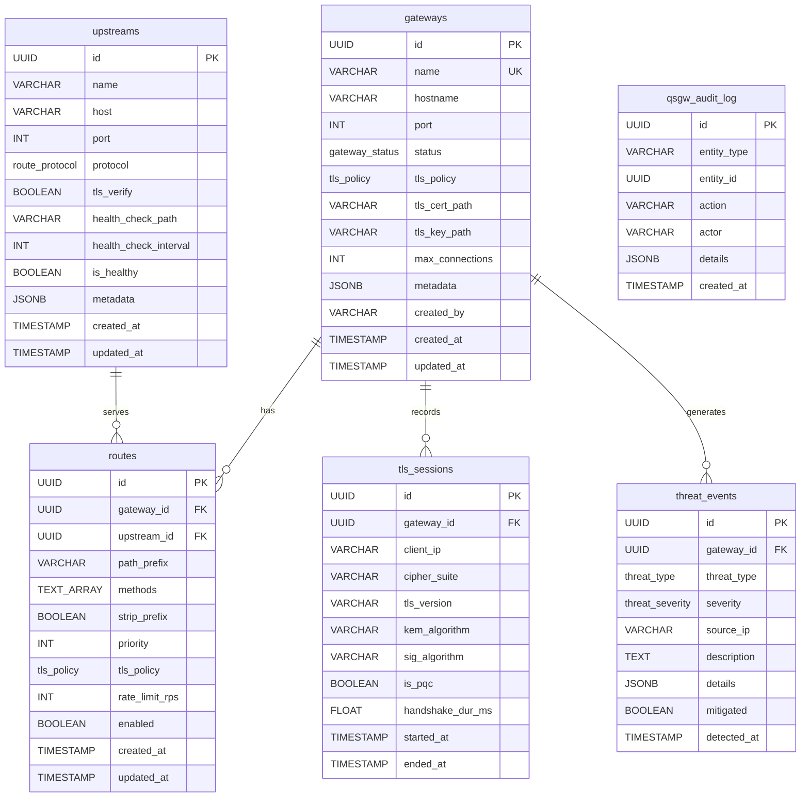

# QSGW Architecture

This document describes the system architecture, design philosophy, component interactions, and data flow of the Quantum-Safe Gateway (QSGW).

## Table of Contents

- [Design Philosophy](#design-philosophy)
- [System Overview](#system-overview)
- [Component Architecture](#component-architecture)
  - [Gateway Engine (Rust)](#gateway-engine-rust)
  - [Crypto Library (Rust)](#crypto-library-rust)
  - [TLS Configuration (Rust)](#tls-configuration-rust)
  - [Control Plane (Go)](#control-plane-go)
  - [AI Engine (Python)](#ai-engine-python)
  - [Admin Dashboard (TypeScript)](#admin-dashboard-typescript)
  - [Shared Middleware (Go)](#shared-middleware-go)
- [Data Flow](#data-flow)
  - [Request Processing Pipeline](#request-processing-pipeline)
  - [TLS Handshake Flow](#tls-handshake-flow)
  - [Threat Detection Flow](#threat-detection-flow)
- [Database Schema](#database-schema)
- [Distributed Configuration](#distributed-configuration)
- [Security Model](#security-model)

---

## Design Philosophy

QSGW is designed around the following principles:

1. **Quantum-readiness first**: Post-quantum cryptography is the default, not an afterthought. Every TLS connection is negotiated with PQC-aware cipher suites unless explicitly configured otherwise.

2. **Defense in depth**: Multiple layers of security -- PQC TLS at the transport layer, authentication and authorization at the application layer, AI-powered threat detection for behavioral analysis, and security headers on every response.

3. **Language-appropriate design**: Each component uses the language best suited to its purpose. Rust for the latency-sensitive gateway and cryptographic primitives. Go for the control plane REST API. Python for machine learning and heuristic analysis. TypeScript for the admin interface.

4. **Gradual migration support**: Four TLS policies (PQC_ONLY, PQC_PREFERRED, HYBRID, CLASSICAL_ALLOWED) allow organizations to adopt post-quantum security incrementally without disrupting existing clients.

5. **Operational simplicity**: Docker Compose for development, environment variables for configuration, structured logging, and health check endpoints on every service.

---

## System Overview



---

## Component Architecture

### Gateway Engine (Rust)

**Crate**: `quantun-qsgw-gateway` | **Location**: `gateway/`

The gateway is the data-plane component that handles all client traffic. It is built on Axum (HTTP framework) and Tokio (async runtime).

**Modules**:

| Module | Responsibility |
|--------|---------------|
| `tls/` | TLS policy configuration, cipher suite classification, PQC handshake setup |
| `auth/` | API key authentication middleware with configurable bypass paths |
| `middleware/` | PQC enforcement middleware, rate limiting, request logging |
| `proxy/` | Reverse proxy engine -- route matching, header rewriting, upstream forwarding |

**Key design decisions**:

- **Axum middleware stack**: The request processing pipeline is a stack of Axum middleware layers. Each layer (PQC enforcement, auth, rate limiting) can short-circuit the request or pass it to the next layer.
- **TLS policy as state**: The TLS policy is injected as Axum state, making it available to all middleware layers without global state.
- **Zero-copy forwarding**: The reverse proxy uses hyper's streaming body to avoid buffering entire request/response bodies in memory.
- **Priority-based route matching**: Routes are matched by path prefix and selected by priority, allowing more specific routes to take precedence.

**Configuration** (`GatewayConfig`):

```
listen_addr:          0.0.0.0:8443
tls_policy:           PqcPreferred (default)
max_connections:      10,000
upstream_timeout_secs: 30
```

### Crypto Library (Rust)

**Crate**: `quantun-crypto` | **Location**: `crypto/`

Pure Rust implementations wrapping the RustCrypto post-quantum crates. All key material is zeroized on drop.

| Module | Algorithm | Standard | Security Levels |
|--------|-----------|----------|-----------------|
| `mlkem.rs` | ML-KEM | FIPS 203 | 1 (512), 3 (768), 5 (1024) |
| `mldsa.rs` | ML-DSA | FIPS 204 | 2 (44), 3 (65), 5 (87) |
| `slhdsa.rs` | SLH-DSA | FIPS 205 | 1-5 (SHA2 128/192/256 s/f) |
| `hybrid.rs` | X25519+ML-KEM-768, Ed25519+ML-DSA-65 | -- | 3 |
| `rng.rs` | Secure RNG | -- | -- |

**Key sizes** (bytes):

| Algorithm | Public Key | Secret Key | Ciphertext/Signature |
|-----------|-----------|-----------|---------------------|
| ML-KEM-512 | 800 | 1,632 | 768 |
| ML-KEM-768 | 1,184 | 2,400 | 1,088 |
| ML-KEM-1024 | 1,568 | 3,168 | 1,568 |
| ML-DSA-44 | 1,312 | 2,560 | 2,420 |
| ML-DSA-65 | 1,952 | 4,032 | 3,309 |
| ML-DSA-87 | 2,592 | 4,896 | 4,627 |

### TLS Configuration (Rust)

**Crate**: `quantun-tls` | **Location**: `tls/`

Provides TLS configuration types and cipher suite definitions that integrate with rustls.

**Cipher suites**:

| Suite | Key Exchange | Encryption |
|-------|-------------|------------|
| `Aes256GcmX25519MlKem768` | X25519 + ML-KEM-768 | AES-256-GCM-SHA384 |
| `Aes128GcmX25519MlKem512` | X25519 + ML-KEM-512 | AES-128-GCM-SHA256 |
| `Aes256GcmMlKem1024` | ML-KEM-1024 | AES-256-GCM-SHA384 |

**Validation rules**:
- At least one preferred algorithm must be specified
- Hybrid PQC key exchange requires TLS 1.3 (TLS 1.2 + hybrid is rejected)
- Certificate paths are validated on startup

### Control Plane (Go)

**Module**: `github.com/yazhsab/qbitel-qsgw/control-plane` | **Location**: `control-plane/`

The control plane is a REST API built with Chi v5 that manages gateway configuration stored in PostgreSQL.

**Internal structure**:

```
control-plane/
  cmd/server/          Application entry point
  internal/
    config/            Environment variable configuration
    handler/           HTTP request handlers
      gateway.go       CRUD + activate/deactivate for gateways
      route.go         CRUD for routes (requires gateway_id)
      upstream.go      CRUD for upstream services
      threat.go        Read-only threat event listing
      health.go        Health check endpoint
    model/             Domain models and API request/response types
    repository/        PostgreSQL queries (pgx v5)
    service/           Business logic layer
```

**Architecture layers**:

```
Handler (HTTP) -> Service (Business Logic) -> Repository (PostgreSQL)
```

- **Handlers** validate input, parse UUIDs, and return JSON responses.
- **Services** orchestrate business rules (e.g., gateway activation transitions).
- **Repositories** execute parameterized SQL queries via pgx.

**Pagination**: All list endpoints support `offset` and `limit` query parameters. Default limit is 20, maximum is 100, maximum offset is 1,000,000.

### AI Engine (Python)

**Package**: `qsgw-ai` | **Location**: `ai-engine/`

FastAPI service providing two detection engines.

**Anomaly Detector** (`anomaly_detector/detector.py`):

Rule-based engine with configurable thresholds:

| Check | Threshold | Severity | Anomaly Type |
|-------|-----------|----------|-------------|
| Quantum downgrade | Weak ciphers (RC4, DES, 3DES, MD5, SHA1) or TLS < 1.2 | CRITICAL | `QUANTUM_DOWNGRADE` |
| Traffic spike | > 600 req/min (HIGH if > 1800 req/min) | MEDIUM-HIGH | `TRAFFIC_SPIKE` |
| Abnormal handshake | > 5000ms handshake duration | MEDIUM | `ABNORMAL_HANDSHAKE` |

**Bot Detector** (`bot_detector/detector.py`):

Heuristic engine with fingerprint analysis:

| Check | Threshold | Category | Confidence |
|-------|-----------|----------|-----------|
| Known bot user-agent | Pattern match list | CRAWLER | 0.95 |
| Missing/short user-agent | < 10 characters | UNKNOWN | 0.80 |
| High request rate | > 300 req/min (ATTACKER if > 1500) | SCRAPER/ATTACKER | 0.85 |
| High path diversity | > 50 unique paths/min | SCRAPER | 0.75 |

### Admin Dashboard (TypeScript)

**Package**: `qsgw-admin` | **Location**: `admin/`

React 19 single-page application built with Vite 6 and TypeScript 5.7.

**Pages**:

| Page | Route | Description |
|------|-------|-------------|
| Dashboard | `/` | Overview metrics and system status |
| Gateways | `/gateways` | Gateway management (list, status, TLS policy) |
| Upstreams | `/upstreams` | Upstream service health monitoring |
| Threats | `/threats` | Threat event timeline and details |

**Shared components**: Card, Button, DataTable (in `components/ui.tsx`).

### Shared Middleware (Go)

**Module**: `github.com/yazhsab/qbitel-qsgw/shared/go` | **Location**: `shared/go/`

Reusable Go middleware used by the control plane.

| Middleware | File | Description |
|-----------|------|-------------|
| Authentication | `middleware/auth.go` | JWT (HS256) and API key validation with constant-time comparison |
| Rate Limiting | `middleware/ratelimit.go` | Per-key sliding window with background cleanup |
| Security Headers | `middleware/security.go` | HSTS, CSP, X-Frame-Options, CORS |
| Pagination | `middleware/pagination.go` | Query parameter parsing and validation |
| Database Pool | `database/pool.go` | PostgreSQL connection pooling via pgx |

---

## Data Flow

### Request Processing Pipeline



### TLS Handshake Flow



### Threat Detection Flow



---

## Database Schema

### Entity Relationship Diagram



### Enum Types

| Enum | Values |
|------|--------|
| `gateway_status` | `ACTIVE`, `INACTIVE`, `DRAINING`, `FAILED` |
| `route_protocol` | `HTTP`, `HTTPS`, `GRPC`, `TCP`, `TLS` |
| `tls_policy` | `PQC_ONLY`, `PQC_PREFERRED`, `HYBRID`, `CLASSICAL_ALLOWED` |
| `threat_severity` | `CRITICAL`, `HIGH`, `MEDIUM`, `LOW`, `INFO` |
| `threat_type` | `QUANTUM_DOWNGRADE`, `WEAK_CIPHER`, `BOT_ATTACK`, `ANOMALOUS_TRAFFIC`, `CERTIFICATE_ISSUE`, `REPLAY_ATTACK` |

### Indexes

| Table | Index | Columns |
|-------|-------|---------|
| `routes` | `idx_routes_gateway` | `gateway_id` |
| `tls_sessions` | `idx_tls_sessions_gateway` | `gateway_id` |
| `tls_sessions` | `idx_tls_sessions_started` | `started_at` |
| `threat_events` | `idx_threat_events_gateway` | `gateway_id` |
| `threat_events` | `idx_threat_events_detected` | `detected_at` |
| `threat_events` | `idx_threat_events_severity` | `severity` |
| `qsgw_audit_log` | `idx_qsgw_audit_log_entity` | `entity_type`, `entity_id` |

### Triggers

All tables with `updated_at` columns (`gateways`, `upstreams`, `routes`) have a `BEFORE UPDATE` trigger that automatically sets `updated_at = NOW()`.

---

## Distributed Configuration

QSGW uses **etcd** for distributed configuration and service coordination.

**Use cases**:
- Gateway configuration propagation across multiple instances
- Service discovery for upstream health status
- Distributed rate limit state (planned)
- Leader election for control plane HA (planned)

**Connection**: The control plane connects to etcd via the `QSGW_ETCD_ADDR` environment variable (default: `http://127.0.0.1:2379`).

---

## Security Model

### Transport Security

- All client-facing traffic terminates at the Gateway with PQC TLS 1.3
- Cipher suite negotiation is governed by the configured TLS policy
- Classical-only connections are rejected under PQC_ONLY policy
- The `x-tls-cipher-suite` header carries cipher suite information through the middleware pipeline

### Authentication

The control plane supports two authentication mechanisms:

1. **JWT (HS256)**: HMAC-SHA256 signed tokens with `sub`, `role`, `exp`, `nbf`, and `iss` claims. The `none` algorithm is explicitly rejected. Signatures are verified with constant-time comparison.

2. **API Keys**: Configured as `key:subject:role` entries. Validated using constant-time comparison across all entries to prevent timing side-channel attacks.

Both mechanisms inject `subject`, `role`, and `auth_method` into the request context for downstream authorization.

### Authorization

- Role-based access control via `RequireRole()` middleware
- Configurable bypass paths (e.g., `/health`) skip authentication entirely

### Rate Limiting

- Per-IP sliding window counter with configurable window size and request limit
- Memory-bounded to 100,000 tracked keys to prevent DoS via memory exhaustion
- Automatic background cleanup of expired entries
- Standard `X-RateLimit-*` and `Retry-After` response headers

### Response Security Headers

Every response includes:
- `Strict-Transport-Security: max-age=63072000; includeSubDomains`
- `Content-Security-Policy: default-src 'none'`
- `X-Content-Type-Options: nosniff`
- `X-Frame-Options: DENY`
- `Referrer-Policy: strict-origin-when-cross-origin`
- `Permissions-Policy: geolocation=(), camera=(), microphone=()`
- `Cache-Control: no-store`

### CORS

- Origin whitelist with wildcard support
- Automatic disabling of credentials when wildcard origin is used (prevents misconfiguration)
- Preflight caching with configurable max-age (default: 24 hours)

### Cryptographic Hygiene

- All secret key material uses `zeroize` for secure memory cleanup on drop
- No use of the JWT `none` algorithm
- Minimum TLS version enforced at 1.3 for PQC cipher suites
- JSONB metadata fields for extensibility without schema changes
